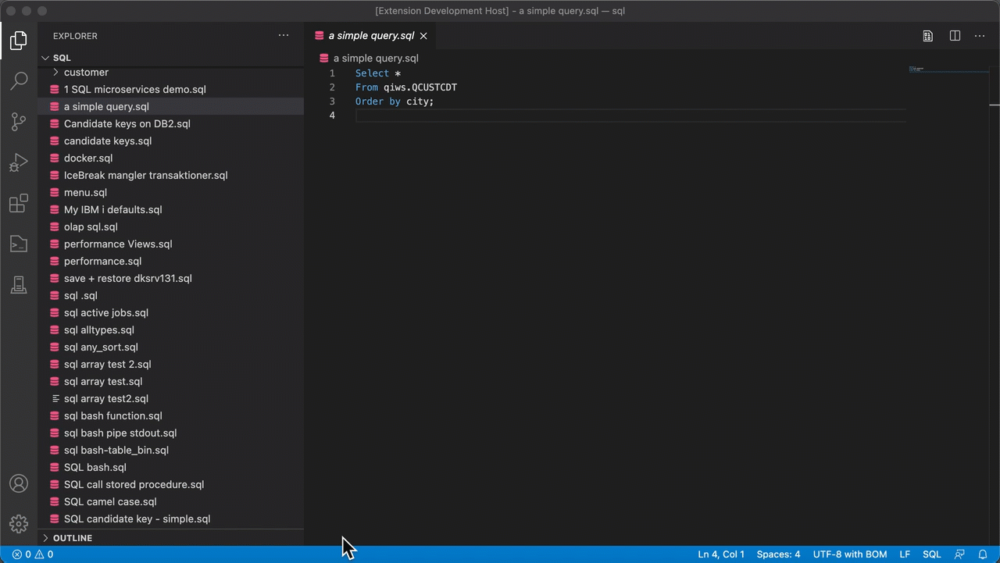

# IBM i - Run SQL from ACS

This extension lets you use VSCode as the project explorer and lets you open and run any SQL file with IBM i Access Client solution (ACS). This gives you a perfect integration between VSCode and IBM i ACS. VSCode comes with loads of features like git and replace in files etc. - now with this extension it is all integrated.

## Demo


## Requirements

You need to install IBM i Access Client solution (ACS) on your win/mac/linux and the Java environment to run it - but you probably already have that up and running. After you have installed this extension, then click on setting and fill in the required parameters in your workspace:

### The ACS jar file

Find the location of the the acsbundle.jar . Normally it is found in the user folder "ibmiaccess" so the complete path will then be:

/usr/local/ibmiaccess/acsbundle.jar

### The IBM i host 

This is the network name or TCP/IP address of you IBM i, defined in the host list in ACS. Separarte the names of hosts by a comma: 
```
IBMI1,IBMI2 
```
And you can even have different hosts in either the workspace ( project specific) or defined by user ( user / global).

### Default schema

The default schema ( library ) where tables, views etc will be created if you not fully qualify them

